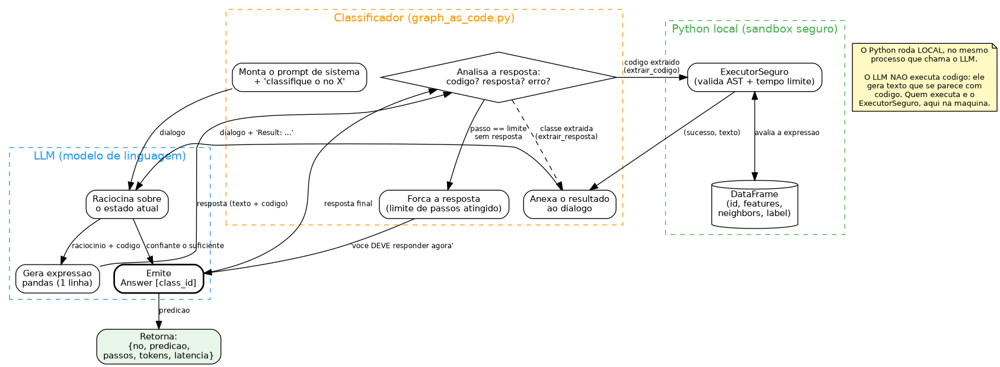

# Graph-as-Code

> Uma implementação didática e reprodutível do método **Graph-as-Code**: fazer um LLM
> classificar nós de um grafo gerando código em vez de descrever o grafo inteiro no prompt.
>
> **Mantido por:** Luiz Fernando P. Quirino (PPGCC/FACOM/UFMS)
> **Método original:** Finkelshtein et al. (ICLR 2026), "Actions Speak Louder than Prompts"

---

## O que é isto

Este repositório reúne, num lugar só e explicado passo a passo, tudo que você precisa
para **entender e reproduzir** o método Graph-as-Code (GaC):

- o código do método, num único arquivo comentado;
- um exemplo que roda de verdade sobre o dataset Cora;
- slides completos que contam a história do método;
- documentação em português pensada para quem está começando (graduação).

A ideia central do método em uma frase: em vez de despejar o grafo inteiro no prompt do
LLM, você deixa o LLM **explorar o grafo por conta própria, gerando expressões de código
(pandas)** que são executadas, e ele decide a classe do nó a partir do que descobre.

```
LLM gera código  ->  Python executa  ->  resultado volta ao LLM  ->  repete até decidir
```



O LLM nunca executa código: ele gera texto que se parece com código. Quem executa é um
sandbox local (`ExecutorSeguro`), no mesmo processo que chama o modelo. Os diagramas
completos estão em [`docs/diagramas/`](docs/diagramas/).

---

## Comece por aqui

Se você é aluno de graduação e nunca viu isso, siga nesta ordem:

1. [`docs/01-o-que-e-graph-as-code.md`](docs/01-o-que-e-graph-as-code.md): a intuição, sem código.
2. [`docs/02-como-funciona-passo-a-passo.md`](docs/02-como-funciona-passo-a-passo.md): o mecanismo, com um exemplo real.
3. [`docs/03-reproduzir-do-zero.md`](docs/03-reproduzir-do-zero.md): rode você mesmo, do zero.
4. [`docs/04-genealogia-do-metodo.md`](docs/04-genealogia-do-metodo.md): de onde o método veio (CoT, PAL, ReAct, CodeGraph).

Para trocar de provedor de LLM (OpenRouter, OpenAI, Ollama), veja
[`docs/05-usando-as-apis.md`](docs/05-usando-as-apis.md).

Os slides em [`slides/graph-as-code-slides.pdf`](slides/graph-as-code-slides.pdf) cobrem
tudo isso de forma visual.

---

## Rodar em 3 passos

```bash
cd codigo
pip install -r requirements.txt

# configure a chave do provedor (copie o modelo e preencha):
cp .env.example .env

# Opção A: provedor padrão do projeto, OpenRouter
export OPENROUTER_API_KEY=...
python exemplo_cora.py --n 5 --modelo openai/o4-mini

# Opção B: com a API da própria OpenAI
export OPENAI_API_KEY=sk-...
python exemplo_cora.py --n 5 --provedor openai --modelo o4-mini

# Opção C: 100% local e sem custo, via Ollama
python exemplo_cora.py --n 5 --provedor ollama --modelo qwen2.5:14b
```

Este projeto usa o **OpenRouter** por padrão: uma API compatível com a da OpenAI que dá
acesso a vários modelos (o4-mini, DeepSeek, Qwen, Llama) com uma única chave. Você verá,
para cada nó, o raciocínio do LLM e cada expressão de código que ele gera, terminando na
classe prevista. Detalhes em [`docs/03-reproduzir-do-zero.md`](docs/03-reproduzir-do-zero.md).

Uma ressalva importante: o OpenRouter é o padrão aqui **pela praticidade de validar o
código** (uma única chave, vários modelos), não por rigor experimental. Ele pode
encaminhar a mesma requisição para provedores ou instâncias diferentes do mesmo modelo,
com pequenas diferenças de tokenização, quantização ou versão. Por isso, mesmo com
temperatura 0 e semente fixa, **pequenas variações percentuais nos resultados são
esperadas e documentadas**. Para medições que exijam reprodutibilidade estrita, fixe o
provedor (rode direto na OpenAI com `--provedor openai`, ou local com Ollama) em vez de
depender do roteamento do OpenRouter.

---

## Estrutura do repositório

```
graph-as-code/
├── README.md               este arquivo
├── CITATION.md             como citar e créditos aos autores originais
├── LICENSE                 licença do código/material deste repo (MIT)
├── codigo/
│   ├── graph_as_code.py    o método inteiro, num arquivo só e comentado
│   ├── exemplo_cora.py     demo rodável sobre o Cora
│   ├── requirements.txt    dependências
│   ├── .env.example        modelo de configuração das chaves de API
│   └── dados-exemplo/      Cora já no formato do método (roda direto)
├── slides/
│   ├── graph-as-code-slides.pdf   apresentação completa
│   └── fonte/                       fonte LaTeX/Beamer (tema UFMS)
├── docs/                   explicações passo a passo (comece por aqui)
│   └── diagramas/          fluxo de dados e sequência (fontes .dot + .png/.svg)
└── resultados/             números de uma reprodução real (o4-mini)
```

---

## Créditos e atribuição

Este repositório é **material didático e de reprodução**. O método não é meu: ele foi
proposto por outros autores, e um repositório que o inspirou também. Dê o crédito a eles.

- **Método Graph-as-Code:** Finkelshtein, Cucerzan, Jauhar & White (2026), "Actions Speak
  Louder than Prompts", *ICLR 2026*. O código aqui reimplementa a ideia do artigo
  (Template 3, Appendix F) de forma independente e simplificada.
- **CodeGraph (precursor direto):** Cai, Wang, Chen, Yin, Wu & Zhang (2024), "Enhancing
  Graph Reasoning of LLMs with Code", *arXiv:2408.13863*. É o trabalho que introduziu a
  ideia de o LLM resolver problemas de grafo gerando código; o Graph-as-Code estende essa
  ideia com iteração e feedback.
- **Datasets:** Cora (McCallum et al., 2000) e OGBN-ArXiv (Hu et al., 2020). Ver
  [`CITATION.md`](CITATION.md).

Detalhes completos de citação em [`CITATION.md`](CITATION.md).

---

## Licença

O código e a documentação **deste repositório** estão sob licença MIT (ver
[`LICENSE`](LICENSE)). Isso cobre a minha reimplementação e os textos didáticos, não os
artigos nem os datasets originais, que pertencem aos seus respectivos autores.
