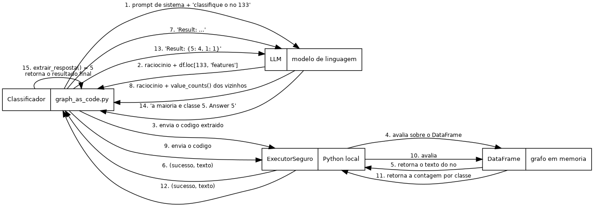

# Diagramas

Dois diagramas que mostram como os dados andam no método. As fontes estão em `.dot`
(Graphviz); os `.png` e `.svg` são gerados a partir delas.

---

## Fluxo de dados


Mostra os três atores (o LLM, o Python local e o classificador que orquestra) e como a
informação circula entre eles. O ponto central: o LLM gera texto que parece código, mas
quem executa é o `ExecutorSeguro`, aqui na máquina. O LLM nunca roda código.

---

## Sequência



Mostra a ordem temporal das mensagens em uma classificação típica: o classificador pede,
o LLM raciocina e devolve uma expressão, o executor avalia sobre o DataFrame, o resultado
volta, e isso se repete até o LLM responder a classe.

---

## Como regenerar as imagens

Precisa do Graphviz instalado (`dot`):

```bash
dot -Tpng fluxo-dados.dot -o fluxo-dados.png
dot -Tsvg fluxo-dados.dot -o fluxo-dados.svg
dot -Tpng sequencia.dot   -o sequencia.png
dot -Tsvg sequencia.dot   -o sequencia.svg
```
